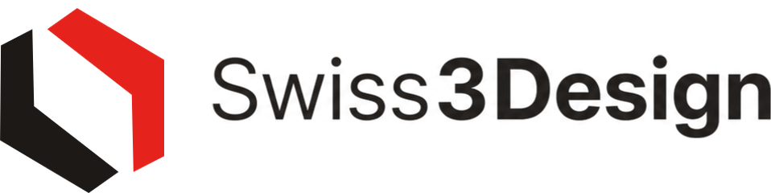
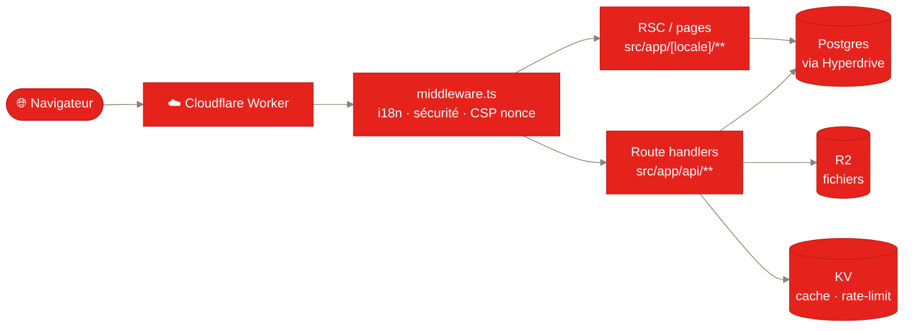
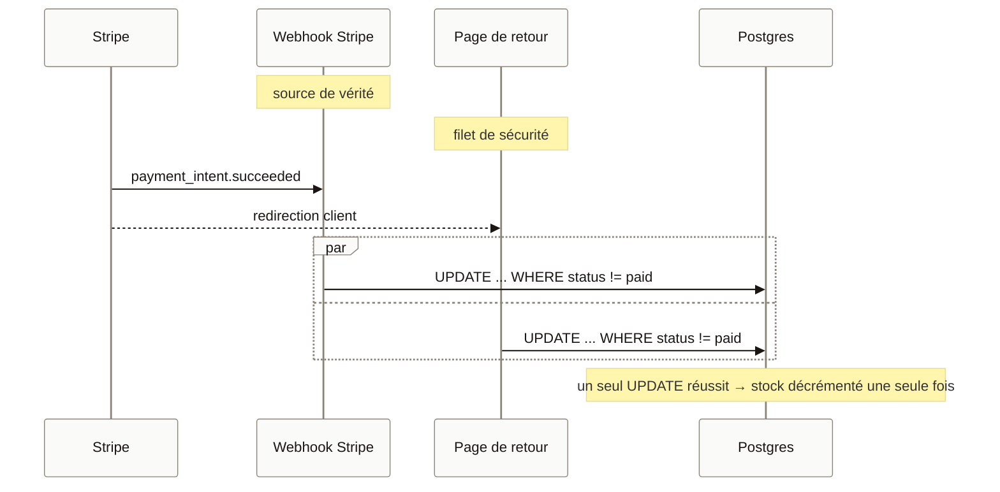

<div align="center">

<picture>
  <source media="(prefers-color-scheme: dark)" srcset="public/brand/png/logo-dark-960.png" />
  
</picture>

### Impression 3D multicolore en Suisse

Boutique e-commerce d'objets design imprimés en 3D jusqu'à **4 couleurs**,
fabriqués à **Gland (VD)** et livrés dans toute la Suisse.

🌐 **[swiss3design.ch](https://swiss3design.ch)**

[](https://swiss3design.ch)

<br />


</div>

<br />

<div align="center">

**[Aperçu](#aperçu)** · **[Architecture](#architecture)** · **[Fonctionnalités](#fonctionnalités)** · **[Identité visuelle](#identité-visuelle)** · **[Stack technique](#stack-technique)** · **[Structure du projet](#structure-du-projet)** · **[Démarrage rapide](#démarrage-rapide)** · **[Base de données](#base-de-données)** · **[Déploiement](#déploiement)** · **[Sécurité](#sécurité)** · **[Documentation](#documentation)**

</div>

---

## Aperçu

Swiss3Design est une boutique en ligne complète : catalogue, panier, paiement,
devis sur mesure, comptes clients et back-office d'administration. Le site est
**en production** sur [swiss3design.ch](https://swiss3design.ch), déployé sur
**Cloudflare Workers** et alimenté par **Postgres (Neon)** via **Cloudflare
Hyperdrive**, un stockage de fichiers **R2** et un cache **KV** — 100 %
Cloudflare côté hébergement, sans process Node persistant.

Le site est multilingue (🇫🇷 🇩🇪 🇮🇹 🇬🇧) avec détection automatique de la langue
du navigateur, et propose un mode clair/sombre.

---

## Architecture

Tout tourne dans **un seul Worker Cloudflare** — pas de process Node
persistant, tout sur le runtime Edge (`nodejs_compat`).



Le paiement (commande **et** devis) se finalise via une écriture **idempotente**
— webhook Stripe et page de retour peuvent arriver dans n'importe quel ordre,
un seul l'emporte :



Détails complets (modèle de données, auth, R2, CSP) :
[`docs/architecture.md`](docs/architecture.md).

---

## Fonctionnalités

### Côté client

- 🛍️ **Boutique** — catalogue par catégories, fiches produits, choix des couleurs
  et matières, galerie d'images, **viewer 3D** interactif (Three.js).
- 🎨 **Configurateur multicolore** — sélection jusqu'à 4 couleurs par objet.
- 🧾 **Devis sur mesure** — envoi de fichiers 3D (upload R2), chiffrage, puis
  paiement du devis en ligne.
- 🛒 **Panier & paiement** — tunnel de commande avec **Stripe Payment Element**
  (cartes, TWINT, Apple/Google Pay), codes promo, frais de port suisses.
- ❤️ **Favoris** — produits mis de côté.
- ⭐ **Avis vérifiés** — ouverts après livraison sur les articles achetés,
  modérés en admin.
- 👤 **Comptes clients** — inscription, connexion e-mail + **Google**, 2FA
  TOTP, passkeys, historique des commandes et des devis.
- 📦 **Suivi invité** — page `/track` pour suivre une commande sans compte, avec
  conversion invité → compte et rattachement des commandes.
- 🌍 **Multilingue & thème** — fr/de/it/en, bascule clair/sombre.

### Côté administration (`/admin`)

Gestion complète : produits, catégories, matières, mises en avant, codes promo,
commandes, devis, avis, clients, e-mails transactionnels & annonces newsletter,
réglages de la boutique.

---

## Identité visuelle

L'identité suit une ligne **« Swiss business »** : neutres chauds, **rouge suisse**
en accent, typographie nette, et un logomark géométrique.

<div align="center">


</div>

| Élément | Valeur |
| --- | --- |
| 🔴 Rouge marque | `#E5231C` (accent foncé : `#C01D14`) |
| ⚫ Encre (texte) | `#1A1614` clair · `#F4F1ED` sombre |
| ⚪ Papier (fond) | `#FAFAF9` clair · `#0B0A09` sombre |
| 🔤 Police | **Geist Sans** (`next/font`) |
| 🧊 Logo | Cube isométrique, symétrie 180° : un « L » encre + son miroir rouge |

Le **kit de marque** complet est versionné dans [`public/brand/`](public/brand) :

- **Logos** — `svg/`, `png/`, `webp/`, `jpg/` en variantes claire/sombre et
  plusieurs tailles (480 / 960 / 1896 px).
- **Icônes / favicon** — `app/` (favicon.ico, icon.svg, apple-icon, icônes PWA
  192/512) et déclinaisons mono encre/blanc de 16 à 512 px.
- **Réseaux sociaux** — `social/og-image.png` (1200 × 630, balises Open Graph
  & Twitter Card).
- **Illustrations produits** — [`public/products/`](public/products) (SVG).

> 🎨 **Contraintes de marque** : rouge / noir / blanc uniquement ; pas de « 3 »,
> pas de « S », pas de cliché d'impression 3D. Toute nouvelle identité visuelle
> doit être validée avant usage.

---

## Stack technique

| Domaine | Technologie |
| --- | --- |
| Framework | **Next.js 16** (App Router, React Server Components) |
| UI | **React 19**, **Tailwind CSS 4**, [`motion`](https://motion.dev), `lucide-react` |
| Langage | **TypeScript 6** (strict) |
| Runtime & package manager | **Bun** (install / scripts / dev) — déploiement sur `workerd` (Cloudflare Workers) |
| Lint / format | **Biome** (linter + formatter, remplace ESLint depuis 2026-07-09) |
| Base de données | **Postgres (Neon)** via **Cloudflare Hyperdrive** + **Drizzle ORM** |
| Authentification | **better-auth** (e-mail + Google OAuth, 2FA TOTP, passkeys) |
| Paiement | **Stripe** (Payment Element + webhooks, **LIVE** en prod) |
| E-mails | **Resend** (API REST) |
| i18n | **next-intl** (fr/de/it/en) |
| Stockage fichiers | **Cloudflare R2** |
| Cache / rate-limit | **Cloudflare KV** |
| Hébergement | **Cloudflare Workers** via [`@opennextjs/cloudflare`](https://opennext.js.org/cloudflare) |

> ℹ️ Le projet a migré de D1/SQLite vers Postgres/Hyperdrive le 2026-07-09
> (voir [`AGENTS.md`](AGENTS.md#what-this-is)). D1 reste câblé dans
> `wrangler.jsonc` comme filet de secours inactif, pas comme base active.

---

## Intégrations

- **Stripe** *(LIVE en production)* — Payment Element pour les commandes et le
  paiement des devis, webhooks pour la confirmation des paiements.
- **better-auth + Google OAuth** — sessions, comptes, rôle admin attribué
  automatiquement aux adresses de `ADMIN_EMAILS`.
- **Cloudflare** — Hyperdrive → Postgres/Neon, R2 (`swiss3design-files`), KV,
  D1 (`swiss3design-db`, filet de secours), domaine personnalisé `swiss3design.ch`.
- **Neon Postgres** — base active (`swiss3design`), branche `preview` isolée
  pour l'environnement de test (jamais de données clients réelles).
- **Resend** — e-mails transactionnels (confirmations, devis, comptes). Les
  réponses clients arrivent sur l'alias **Infomaniak** `contact@swiss3design.ch`.

---

## Structure du projet

```text
Swiss3Design/
├─ docs/                          # Doc interne : architecture, conventions, playbook, runbook, déploiement
├─ drizzle-pg/                    # Migrations Postgres (drizzle-kit, actif) — NE PAS éditer à la main
├─ drizzle/                       # Migrations D1/SQLite legacy (filet de secours) — NE PAS éditer à la main
├─ messages/                      # Traductions next-intl (fr, de, it, en)
├─ public/
│  ├─ brand/                      # Kit de marque (logos, icônes, og-image)
│  ├─ products/                   # Illustrations produits (SVG)
│  ├─ avatars/                    # Avatars par défaut
│  ├─ about/                      # Photos page « À propos »
│  └─ .well-known/security.txt    # Contact sécurité
├─ scripts/                       # Outils hors-app
│  ├─ push.bat                    # Publier : commit + push (= déploiement auto)
│  ├─ seed.sql / seed-categories.sql  # Jeux de données D1 legacy (rollback)
│  └─ migrate-d1-to-pg.ts         # Outil de migration D1 → Postgres (Bun)
├─ src/
│  ├─ app/
│  │  ├─ [locale]/                # Pages localisées (boutique, compte, admin, devis…)
│  │  ├─ api/                     # Routes API (Stripe, auth, fichiers, cron…)
│  │  ├─ globals.css              # Thème Tailwind v4 (clair/sombre, rouge marque)
│  │  ├─ manifest.ts              # Manifest PWA
│  │  └─ favicon.ico · icon.svg · apple-icon.png
│  ├─ components/                 # Composants UI (header, footer, product-card…)
│  ├─ db/                         # Drizzle : schema.pg.ts (source de vérité), queries, client Hyperdrive
│  ├─ i18n/                       # Config next-intl (routing, request, navigation)
│  ├─ lib/                        # Logique métier (auth, panier, stripe, email…)
│  └─ middleware.ts               # Middleware Edge (i18n + sécurité + CSP nonce)
├─ workers/cron/                  # Worker Cron autonome (purge R2, relances panier)
├─ next.config.ts                 # Next.js + next-intl + OpenNext
├─ open-next.config.ts            # Adaptateur Cloudflare (build webpack)
├─ wrangler.jsonc                 # Bindings Cloudflare (Hyperdrive, R2, KV, D1) + domaine
├─ drizzle.config.pg.ts           # Config drizzle-kit — Postgres (actif)
├─ drizzle.config.ts              # Config drizzle-kit — D1 (legacy)
├─ biome.jsonc                    # Lint + format (Biome)
├─ AGENTS.md                      # Guide pour agents IA (CLAUDE.md l'importe)
└─ ROADMAP.md                     # Feuille de route
```

---

## Démarrage rapide

**Prérequis** : [Bun](https://bun.sh) 1.3+, un compte Cloudflare, une base
Postgres (ex. [Neon](https://neon.tech), palier gratuit) et un compte Stripe
(mode test pour le développement).

```bash
# 1. Installer les dépendances
bun install

# 2. Créer les secrets locaux (non versionnés) dans .dev.vars
#    voir « Variables d'environnement » ci-dessous — inclut DATABASE_URL

# 3. Appliquer le schéma sur la base Postgres locale/de dev
bun run db:push:pg

# 4. Lancer le serveur de développement
bun run dev
```

Le site est servi sur **http://localhost:3000**. Le `next dev` charge les
bindings Cloudflare (Hyperdrive, R2, KV) via OpenNext.

> 💡 La **CSP avec nonce** n'est active qu'en production. Pour la tester avant
> de déployer : `bun run preview` (build + aperçu Workers en local).

---

## Variables d'environnement

<details>
<summary><strong>Clés publiques (versionnées)</strong></summary>

<br />

`.env.development` (Stripe **test**) et `.env.production` (Stripe **live**) :

| Variable | Rôle |
| --- | --- |
| `NEXT_PUBLIC_STRIPE_PUBLISHABLE_KEY` | Clé publiable Stripe (test en dev, live en prod) |

</details>

<details>
<summary><strong>Secrets — local : <code>.dev.vars</code> · prod : secrets Cloudflare</strong></summary>

<br />

> ⚠️ Jamais versionnés. En production, gérés via `wrangler secret put` ou le
> dashboard Cloudflare.

| Variable | Rôle |
| --- | --- |
| `DATABASE_URL` | Connexion Postgres (dev local / `drizzle-kit`) |
| `CLOUDFLARE_HYPERDRIVE_LOCAL_CONNECTION_STRING_HYPERDRIVE` | Émulation Hyperdrive locale (même Postgres) |
| `STRIPE_SECRET_KEY` | Clé secrète Stripe |
| `STRIPE_WEBHOOK_SECRET` | Signature des webhooks Stripe |
| `BETTER_AUTH_SECRET` | Secret de signature des sessions |
| `RESEND_API_KEY` | Envoi d'e-mails (optionnel — sans clé, l'envoi est ignoré) |
| `GOOGLE_CLIENT_ID` / `GOOGLE_CLIENT_SECRET` | Connexion Google |
| `CRON_SECRET` | Jeton de la maintenance planifiée (purge R2) |

</details>

<details>
<summary><strong>Variables non-secrètes & bindings (dans <code>wrangler.jsonc</code>)</strong></summary>

<br />

| Variable | Valeur |
| --- | --- |
| `BETTER_AUTH_URL` | `https://swiss3design.ch` |
| `ADMIN_EMAILS` | Adresses recevant le rôle admin |
| `EMAIL_FROM` | Expéditeur des e-mails |

Bindings : `HYPERDRIVE` (Postgres actif) · `DB` (D1, filet de secours) ·
`R2` (fichiers) · `KV` (cache / rate-limit) · `ASSETS` ·
`WORKER_SELF_REFERENCE`. Types régénérés avec `bun run cf-typegen`.

</details>

---

## Scripts

<details open>
<summary><strong>Voir la liste complète</strong></summary>

<br />

| Script | Action |
| --- | --- |
| `bun run dev` | Serveur de développement (bindings Cloudflare inclus) |
| `bun run build` | Build Next.js |
| `bun run lint` | Biome (lint) |
| `bun run format` | Biome (format --write) |
| `bun run typecheck` | `tsc --noEmit` |
| `bun run test` | Vitest |
| `bun run preview` | Build OpenNext + aperçu Workers en local (teste la CSP prod) |
| `bun run deploy` | Build OpenNext + déploiement Cloudflare |
| `bun run cf-typegen` | Régénère `cloudflare-env.d.ts` depuis `wrangler.jsonc` |
| `bun run db:generate:pg` | Génère une migration Drizzle depuis `src/db/schema.pg.ts` |
| `bun run db:push:pg` | Applique le schéma directement sur Postgres |

</details>

---

## Base de données

Schéma défini dans [`src/db/schema.pg.ts`](src/db/schema.pg.ts) (Drizzle ORM,
dialecte **Postgres** — `schema.ts` n'en est qu'un re-export, tous les appels
utilisent toujours `@/db/schema`). Le workflow :

```bash
# 1. Modifier le schéma
#    éditer src/db/schema.pg.ts

# 2. Générer + appliquer la migration
bun run db:generate:pg   # écrit dans drizzle-pg/
bun run db:push:pg       # applique sur la vraie base Neon
```

**Contrairement à l'ancien D1** (migrations auto-appliquées par Cloudflare
Workers Builds à chaque déploiement), **un `git push`/`bun run deploy` ne
touche jamais le schéma Postgres.** Toujours exécuter `db:push:pg` *avant* de
déployer du code qui dépend de nouvelles colonnes/tables — l'ordre compte.

Les migrations sont stockées dans [`drizzle-pg/`](drizzle-pg) — ne jamais
éditer un fichier déjà appliqué.

---

## Déploiement

Hébergement **Cloudflare Workers** via l'adaptateur OpenNext. Le build de
production utilise **webpack** (les chunks Turbopack cassent le bundling
OpenNext).

### Automatique (recommandé)

Le dépôt est connecté à **Cloudflare Workers Builds** (intégration Git native).
Tout push sur `main` déclenche, côté Cloudflare et avec ses propres identifiants :

1. build OpenNext (`opennextjs-cloudflare build`) ;
2. **déploiement** sur Cloudflare Workers.

> Il n'y a **plus de workflow GitHub Actions** : le statut de déploiement est porté
> par le *check* « Cloudflare Workers Builds » sur le commit (vert = build **et**
> deploy réussis ; rouge = l'ancienne version reste en ligne, rien n'est cassé).
> **Toujours vérifier qu'un push a réellement déployé** — l'auto-trigger
> Cloudflare s'est déjà avéré peu fiable. Détails, filet de secours manuel et
> configuration de preview : [`docs/deploiement-cloudflare.md`](docs/deploiement-cloudflare.md).

Pour publier en un clic : double-cliquer sur [`scripts/push.bat`](scripts/push.bat)
(commit + push), et la mise en production démarre automatiquement.

### Manuel

```bash
bun run deploy   # build + déploiement depuis la machine locale
```

Le domaine `swiss3design.ch` (et `www`) est routé en *custom domain* dans
[`wrangler.jsonc`](wrangler.jsonc).

---

## Sécurité

- **CSP avec nonce par requête** en production (plus d'`unsafe-inline`). Tout
  `<script>` inline doit recevoir le `nonce` — à vérifier via `bun run preview`.
- **Middleware Edge** ([`src/middleware.ts`](src/middleware.ts)) : routage i18n
  et en-têtes de sécurité.
- **Rate-limiting** via KV ([`src/lib/rate-limit.ts`](src/lib/rate-limit.ts)).
- **`security.txt`** publié sous [`public/.well-known/`](public/.well-known).
- Corrections issues d'un audit **PentestTools**.

---

## Internationalisation

Quatre langues gérées par **next-intl** : **français** (défaut), allemand,
italien, anglais. La langue est détectée via l'en-tête `Accept-Language`, puis
reflétée dans l'URL (`/fr`, `/de`, `/it`, `/en`). Les traductions vivent dans
[`messages/`](messages).

---

## Documentation

| Document | Pour qui | Contenu |
| --- | --- | --- |
| [`AGENTS.md`](AGENTS.md) | Agents IA | Brief opérationnel + règles d'or (chargé via `CLAUDE.md`) |
| [`docs/architecture.md`](docs/architecture.md) | Agents / dev | Modèle de données, flux, runtime |
| [`docs/conventions.md`](docs/conventions.md) | Agents / dev | Patterns de code & pièges |
| [`docs/playbook.md`](docs/playbook.md) | Humain ↔ IA | Comment demander et réaliser une tâche efficacement |
| [`docs/runbook.md`](docs/runbook.md) | Ops | Déploiement, rollback, incidents, secrets |
| [`docs/deploiement-cloudflare.md`](docs/deploiement-cloudflare.md) | Ops | Connexion Git ↔ Cloudflare Workers Builds |
| [`docs/codemap.md`](docs/codemap.md) | Agents / dev | « Je dois faire X » → fichier(s) exact(s) |
| [`docs/refonte-plateforme-2026.md`](docs/refonte-plateforme-2026.md) | Produit | Proposition de refonte (pas encore implémentée) |
| [`SECURITY.md`](SECURITY.md) | Sécurité | Signalement de vulnérabilité |
| [`ROADMAP.md`](ROADMAP.md) | Produit | État du projet & suite envisagée |
| [`LICENSE.md`](LICENSE.md) | Légal | Propriété & interdictions (tous droits réservés) |

## Propriété & licences

Projet **privé** — © 2026 Swiss3Design. **Tous droits réservés.** Aucune reprise,
modification, redistribution ou contribution externe n'est autorisée — voir
[`LICENSE.md`](LICENSE.md).

Les modèles 3D proposés à la vente sont des **produits tiers sous licence** (libres
pour un usage commercial) : ils **n'appartiennent pas** à Swiss3Design et restent
soumis à la licence de leurs auteurs ; chacune doit autoriser la vente
d'impressions physiques.

<div align="center">

---

Fait avec ❤️ en Suisse · [swiss3design.ch](https://swiss3design.ch)

</div>
