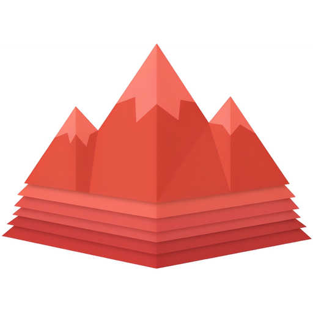
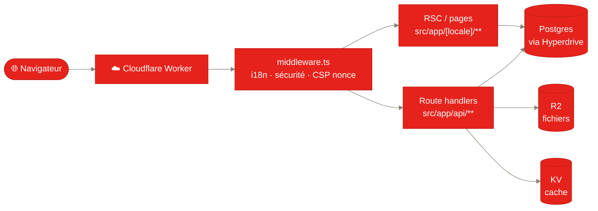
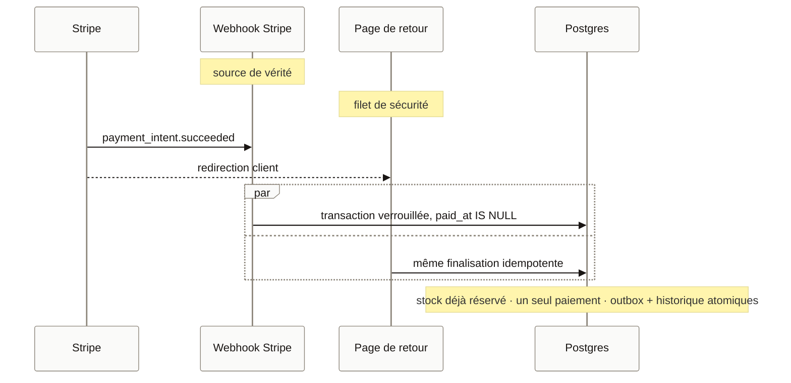

<div align="center">



### Impression 3D multicolore en Suisse

Boutique e-commerce d'objets design imprimés en 3D jusqu'à **4 couleurs**,
fabriqués à **Gland (VD)** et livrés dans toute la Suisse.

🌐 **[swiss3design.ch](https://swiss3design.ch)**

[](https://swiss3design.ch)

<br />


</div>

<br />

<div align="center">

**[Aperçu](#aperçu)** · **[Architecture](#architecture)** · **[Fonctionnalités](#fonctionnalités)** · **[Identité visuelle](#identité-visuelle)** · **[Stack technique](#stack-technique)** · **[Structure du projet](#structure-du-projet)** · **[Démarrage rapide](#démarrage-rapide)** · **[Base de données](#base-de-données)** · **[Déploiement](#déploiement)** · **[Sécurité](#sécurité)** · **[Documentation](#documentation)**

</div>

---

## Aperçu

Swiss3Design est une boutique en ligne complète : catalogue, panier, paiement,
devis sur mesure, comptes clients et back-office d'administration. Le site est
**en production** sur [swiss3design.ch](https://swiss3design.ch), déployé sur
**Cloudflare Workers** et alimenté par **Postgres (Neon)** via **Cloudflare
Hyperdrive**, un stockage de fichiers **R2** et un cache **KV** — 100 %
Cloudflare côté hébergement, sans process Node persistant.

Le site est multilingue (🇫🇷 🇩🇪 🇮🇹 🇬🇧) avec détection automatique de la langue
du navigateur, et propose un mode clair/sombre.

---

## Architecture

Tout tourne dans **un seul Worker Cloudflare** — pas de process Node
persistant, tout sur le runtime Edge (`nodejs_compat`).


```mermaid
%%{init: {'theme':'base', 'themeVariables': {'primaryColor':'#E5231C','primaryTextColor':'#ffffff','primaryBorderColor':'#C01D14','lineColor':'#8a8378','secondaryColor':'#FAFAF9','secondaryTextColor':'#1A1614','tertiaryColor':'#FAFAF9','tertiaryTextColor':'#1A1614'}}}%%
flowchart LR
    Browser(["🌐 Navigateur"]) --> Worker["☁️ Cloudflare Worker"]
    Worker --> MW["middleware.ts<br/>i18n · sécurité · CSP nonce"]
    MW --> App["RSC / pages<br/>src/app/[locale]/**"]
    MW --> API["Route handlers<br/>src/app/api/**"]
    App --> PG[("Postgres<br/>via Hyperdrive")]
    API --> PG
    API --> R2[("R2<br/>fichiers")]
    API --> KV[("KV<br/>cache")]
```

Le paiement (commande **et** devis) se finalise via une écriture **idempotente**
— webhook Stripe et page de retour peuvent arriver dans n'importe quel ordre,
un seul l'emporte :


```mermaid
%%{init: {'theme':'base', 'themeVariables': {'primaryColor':'#E5231C','primaryTextColor':'#ffffff','primaryBorderColor':'#C01D14','lineColor':'#8a8378','actorBkg':'#FAFAF9','actorTextColor':'#1A1614','actorBorder':'#8a8378','signalColor':'#1A1614','signalTextColor':'#1A1614'}}}%%
sequenceDiagram
    participant Stripe
    participant Webhook as Webhook Stripe
    participant Retour as Page de retour
    participant DB as Postgres

    Note over Webhook: source de vérité
    Note over Retour: filet de sécurité
    Stripe->>Webhook: payment_intent.succeeded
    Stripe-->>Retour: redirection client
    par
        Webhook->>DB: transaction verrouillée, paid_at IS NULL
    and
        Retour->>DB: même finalisation idempotente
    end
    Note over DB: stock déjà réservé · un seul paiement · outbox + historique atomiques
```

Détails complets (modèle de données, auth, R2, CSP) :
[`docs/architecture.md`](docs/architecture.md).

---

## Fonctionnalités

### Côté client

- 🛍️ **Boutique** — catalogue par catégories, fiches produits, choix des couleurs
  et matières, galerie d'images, **viewer 3D** interactif (Three.js).
- 🎨 **Studio** (`/studio`) — configurateur 3D de quatre objets originaux
  générés en code (vase « Lavaux », carte « Cartouche », sous-verre « Relief »,
  porte-nom « Borne ») : forme, motif, texte en relief, jusqu'à 4 filaments par
  bandes d'altitude, estimation en grammes, durée et changements de filament,
  garde-fous d'imprimabilité, puis envoi à l'atelier (export STL, même demande
  de devis que `/custom`).
- 🖨️ **Accueil interactif** — un vase s'imprime couche par couche sous les yeux du
  visiteur, dont il règle la palette et le motif (WebGL, avec repli en posters
  SVG sans JavaScript, sur mobile et en mouvement réduit).
- 🧾 **Devis sur mesure** — envoi de fichiers 3D (upload R2), chiffrage, puis
  paiement du devis en ligne.
- 🛒 **Panier & paiement** — tunnel de commande avec **Stripe Payment Element**
  (cartes, TWINT, Apple/Google Pay), codes promo, frais de port suisses.
- ❤️ **Favoris** — produits mis de côté.
- ⭐ **Avis vérifiés** — ouverts après livraison sur les articles achetés,
  modérés en admin.
- 👤 **Comptes clients** — inscription, connexion e-mail + **Google**, 2FA
  TOTP, passkeys, historique des commandes et des devis.
- 📦 **Suivi invité** — page `/track` pour suivre une commande sans compte, avec
  conversion invité → compte et rattachement des commandes.
- 🌍 **Multilingue & thème** — fr/de/it/en, bascule clair/sombre.

### Côté administration (`/admin`)

Gestion complète : produits, catégories, matières, mises en avant, codes promo,
commandes, devis, avis, clients, e-mails transactionnels & annonces newsletter,
réglages de la boutique.

---

## Identité visuelle

L'identité suit la direction **« Strates »** (refonte d'octobre 2026) : une couche
d'impression = une courbe de niveau. Papier carte et encre chauds, le **rouge de
la marque** réservé à la « chaleur » (boutons, point final des titres), isolignes,
typographie nette et un logomark géométrique. Spécification complète :
[`docs/redesign-2026/DESIGN-BRIEF.md`](docs/redesign-2026/DESIGN-BRIEF.md).

<div align="center">


</div>

| Élément          | Valeur                                                                                                                              |
| ---------------- | ----------------------------------------------------------------------------------------------------------------------------------- |
| 🔴 Rouge marque  | `#E5231C` (accent foncé : `#C01D14`) ; texte rouge : `#B3170F` clair · `#FF5B4E` sombre                                             |
| ⚫ Encre (texte) | `#1A1614` clair · `#F2EDE4` sombre                                                                                                  |
| ⚪ Papier (fond) | `#F4F0E8` clair · `#0E0D0B` sombre                                                                                                  |
| 🔤 Polices       | **Archivo SemiExpanded** (titres, auto-hébergée) · **Geist** (texte, interface, Stripe) · **Geist Mono** (télémétrie) — licence OFL |
| ⛰️ Logo          | Pic géométrique en couches — couches d'impression + clin d'œil alpin                                                                |

Le logo est en **rouge de marque uniquement, sur fond transparent** : ni blanc
ni noir dans le mark, donc **un seul fichier** suffit pour le thème clair et le
thème sombre (plus de variantes `-light` / `-dark` à maintenir).

Le **kit de marque** est versionné dans [`public/brand/`](public/brand) :

- **Mark** — `webp/mark.webp` (transparent), rendu par
  [`src/components/brand-mark.tsx`](src/components/brand-mark.tsx) dans le
  header, le footer et les pages de compte.
- **Icônes / favicon** — `../favicon.ico` (16/32/48, PNG embarqués avec alpha),
  `app/icon.webp` (Chrome), `app/apple-icon.png` (iOS), `app/icon-192.png` &
  `app/icon-512.png` (PWA). Déclarées via `metadata.icons` — **jamais** par les
  conventions `app/icon.*` de Next, qui les feraient entrer dans le bundle du
  Worker (voir règle d'or 10 dans [`AGENTS.md`](AGENTS.md)).
- **Réseaux sociaux** — `social/og-image.png` (1200 × 630, balises Open Graph
  & Twitter Card).
- **Ancien logo** — `old-logo/` : le cube isométrique et tout son kit, archivés
  lors du changement de logo (août 2026). Conservés pour référence, jamais
  référencés par l'app.
- **Illustrations produits** — [`public/products/`](public/products) (SVG).

> 🎨 **Contraintes de marque** : rouge de marque `#E5231C` sur neutres chauds ;
> pas de blanc ni de noir _dans_ le mark ; pas de « 3 », pas de « S ». Toute
> nouvelle identité visuelle doit être validée avant usage.

---

## Stack technique

| Domaine                   | Technologie                                                                                                             |
| ------------------------- | ----------------------------------------------------------------------------------------------------------------------- |
| Framework                 | **Next.js 16** (App Router, React Server Components)                                                                    |
| UI                        | **React 19**, **Tailwind CSS 4**, `lucide-react`, [`motion`](https://motion.dev) (admin, pages utilitaires)             |
| Mouvement & 3D            | **GSAP**, **Lenis**, **three.js**, d3-contour, earcut — côté client uniquement (`src/motion/**`, jamais dans le Worker) |
| Polices                   | **Archivo SemiExpanded** (auto-hébergée), **Geist**, **Geist Mono** (`next/font`)                                       |
| Mesure d'audience         | **PostHog Cloud EU** au régime suisse (information + refus), relais `/api/relay`                                        |
| Langage                   | **TypeScript 6** (strict)                                                                                               |
| Runtime & package manager | **Bun** (install / scripts / dev) — déploiement sur `workerd` (Cloudflare Workers)                                      |
| Lint / format             | **Oxlint + Oxfmt** (remplace Biome depuis 2026-09-09, qui remplaçait ESLint depuis 2026-07-09)                          |
| Base de données           | **Postgres (Neon)** via **Cloudflare Hyperdrive** + **Drizzle ORM**                                                     |
| Authentification          | **better-auth** (e-mail + Google OAuth, 2FA TOTP, passkeys)                                                             |
| Paiement                  | **Stripe** (Payment Element + webhooks, **LIVE** en prod)                                                               |
| E-mails                   | **Resend** (API REST)                                                                                                   |
| i18n                      | **next-intl** (fr/de/it/en)                                                                                             |
| Stockage fichiers         | **Cloudflare R2**                                                                                                       |
| Cache / rate-limit        | **Cloudflare KV** (idempotence des protocoles d'agents) ; limitation de débit : compteur Postgres                       |
| Hébergement               | **Cloudflare Workers** via [`@opennextjs/cloudflare`](https://opennext.js.org/cloudflare)                               |

> ℹ️ Le projet a migré de D1/SQLite vers Postgres/Hyperdrive le 2026-07-09
> (voir [`AGENTS.md`](AGENTS.md#what-this-is)). D1 reste câblé dans
> `wrangler.jsonc` comme filet de secours inactif, pas comme base active.

---

## Intégrations

- **Stripe** _(LIVE en production)_ — Payment Element pour les commandes et le
  paiement des devis, webhooks pour la confirmation des paiements.
- **better-auth + Google OAuth** — sessions, comptes, rôle admin attribué
  automatiquement aux adresses de `ADMIN_EMAILS`.
- **Cloudflare** — Hyperdrive → Postgres/Neon, R2 (`swiss3design-files`), KV,
  D1 (`swiss3design-db`, filet de secours), domaine personnalisé `swiss3design.ch`.
- **Neon Postgres** — base active (`swiss3design`), branche `preview` isolée
  pour l'environnement de test (jamais de données clients réelles).
- **Resend** — e-mails transactionnels (confirmations, devis, comptes). Les
  réponses clients arrivent sur l'alias **Infomaniak** `contact@swiss3design.ch`.

---

## Structure du projet

```text
Swiss3Design/
├─ docs/                          # Doc interne : architecture, conventions, playbook, runbook, déploiement
├─ drizzle-pg/                    # Migrations Postgres (drizzle-kit, actif) — NE PAS éditer à la main
├─ drizzle/                       # Migrations D1/SQLite legacy (filet de secours) — NE PAS éditer à la main
├─ messages/                      # Traductions next-intl (fr, de, it, en) + <langue>/<namespace>.json
├─ public/
│  ├─ brand/                      # Kit de marque (mark, icônes, og-image) + old-logo/ archivé
│  ├─ products/                   # Illustrations produits (SVG)
│  ├─ posters/                    # Posters SVG d'isolignes (générés par scripts/gen-field-posters.ts)
│  ├─ studio/glyphs/              # Glyphes du texte en relief du Studio (+ licence OFL)
│  ├─ avatars/                    # Avatars par défaut
│  ├─ about/                      # Photos page « L'Atelier »
│  └─ .well-known/security.txt    # Contact sécurité
├─ scripts/                       # Outils hors-app
│  ├─ seed.sql / seed-categories.sql  # Jeux de données D1 legacy (rollback)
│  ├─ migrate-d1-to-pg.ts         # Outil de migration D1 → Postgres (Bun)
│  ├─ check-worker-bundle.ts      # 0 signature three/gsap/lenis dans le Worker (après le build OpenNext)
│  ├─ chunk-report.ts             # Poids du JS par page et par chunk
│  └─ gen-field-posters.ts · fonts/  # Posters SVG et glyphes du Studio
├─ src/
│  ├─ app/
│  │  ├─ [locale]/                # Pages localisées ; (site)/ = vitrine (accueil, boutique, Studio…)
│  │  ├─ api/                     # Routes API (Stripe, auth, fichiers, cron…)
│  │  ├─ globals.css              # Thème Tailwind v4 (clair/sombre, rouge marque)
│  │  ├─ manifest.ts              # Manifest PWA
│  │  └─ favicon.ico · icon.svg · apple-icon.png
│  ├─ components/                 # Composants UI (header, footer, product-card…), ui/ = primitives « Strates », studio/ = Studio
│  ├─ fonts/                      # Archivo SemiExpanded auto-hébergée + licence OFL
│  ├─ gates/                      # Seule porte vers src/motion (next/dynamic, ssr: false)
│  ├─ motion/                     # GSAP, Lenis, three : moteurs client-only (jamais dans le Worker)
│  ├─ db/                         # Drizzle : schema.pg.ts (source de vérité), queries, client Hyperdrive
│  ├─ i18n/                       # Config next-intl (routing, request, navigation)
│  ├─ lib/                        # Logique métier (auth, panier, stripe, email…) ; studio/ = géométrie pure du Studio
│  └─ middleware.ts               # Middleware Edge (i18n + sécurité + CSP nonce)
├─ workers/cron/                  # Worker Cron autonome (purge R2, relances panier)
├─ next.config.ts                 # Next.js + next-intl + OpenNext
├─ open-next.config.ts            # Adaptateur Cloudflare (build webpack)
├─ wrangler.jsonc                 # Bindings Cloudflare (Hyperdrive, R2, KV, D1) + domaine
├─ drizzle.config.pg.ts           # Config drizzle-kit — Postgres (actif)
├─ drizzle.config.ts              # Config drizzle-kit — D1 (legacy)
├─ .oxlintrc.json / .oxfmtrc.json # Lint + format (Oxlint + Oxfmt)
├─ AGENTS.md                      # Guide pour agents IA (CLAUDE.md l'importe)
└─ ROADMAP.md                     # Feuille de route
```

---

## Démarrage rapide

**Prérequis** : [Bun](https://bun.sh) 1.3+, un compte Cloudflare, une base
Postgres (ex. [Neon](https://neon.tech), palier gratuit) et un compte Stripe
(mode test pour le développement).

```bash
# 1. Installer les dépendances
bun install

# 2. Créer les secrets locaux (non versionnés) dans .dev.vars
#    voir « Variables d'environnement » ci-dessous — inclut DATABASE_URL

# 3. Appliquer le schéma sur la base Postgres locale/de dev
bun run db:push:pg

# 4. Lancer le serveur de développement
bun run dev
```

Le site est servi sur **http://localhost:3000**. Le `next dev` charge les
bindings Cloudflare (Hyperdrive, R2, KV) via OpenNext.

> 💡 La **CSP avec nonce** n'est active qu'en production. Pour la tester avant
> de déployer : `bun run preview` (build + aperçu Workers en local).

---

## Variables d'environnement

<details>
<summary><strong>Clés publiques (versionnées)</strong></summary>

<br />

`.env.development` (Stripe **test**) et `.env.production` (Stripe **live**) :

| Variable                             | Rôle                                             |
| ------------------------------------ | ------------------------------------------------ |
| `NEXT_PUBLIC_STRIPE_PUBLISHABLE_KEY` | Clé publiable Stripe (test en dev, live en prod) |

</details>

<details>
<summary><strong>Secrets — local : <code>.dev.vars</code> · prod : secrets Cloudflare</strong></summary>

<br />

> ⚠️ Jamais versionnés. En production, gérés via `wrangler secret put` ou le
> dashboard Cloudflare.

| Variable                                                   | Rôle                                                                            |
| ---------------------------------------------------------- | ------------------------------------------------------------------------------- |
| `DATABASE_URL`                                             | Connexion Postgres (dev local / `drizzle-kit`)                                  |
| `CLOUDFLARE_HYPERDRIVE_LOCAL_CONNECTION_STRING_HYPERDRIVE` | Émulation Hyperdrive locale (même Postgres)                                     |
| `STRIPE_SECRET_KEY`                                        | Clé secrète Stripe                                                              |
| `STRIPE_WEBHOOK_SECRET`                                    | Signature des webhooks Stripe                                                   |
| `BETTER_AUTH_SECRET`                                       | Secret de signature des sessions                                                |
| `RESEND_API_KEY`                                           | Envoi d'e-mails (optionnel — sans clé, l'envoi est ignoré)                      |
| `GOOGLE_CLIENT_ID` / `GOOGLE_CLIENT_SECRET`                | Connexion Google                                                                |
| `CRON_SECRET`                                              | Jeton de la maintenance planifiée (purge R2)                                    |
| `ADMIN_EMAILS`                                             | Adresses recevant le rôle admin (secret plutôt que var en clair — dépôt public) |

</details>

<details>
<summary><strong>Variables non-secrètes & bindings (dans <code>wrangler.jsonc</code>)</strong></summary>

<br />

| Variable          | Valeur                    |
| ----------------- | ------------------------- |
| `BETTER_AUTH_URL` | `https://swiss3design.ch` |
| `EMAIL_FROM`      | Expéditeur des e-mails    |

Bindings : `HYPERDRIVE` (Postgres actif) · `DB` (D1, filet de secours) ·
`R2` (fichiers) · `KV` (cache / rate-limit) · `ASSETS` ·
`WORKER_SELF_REFERENCE`. Types régénérés avec `bun run cf-typegen`.

</details>

---

## Scripts

<details open>
<summary><strong>Voir la liste complète</strong></summary>

<br />

| Script                   | Action                                                       |
| ------------------------ | ------------------------------------------------------------ |
| `bun run dev`            | Serveur de développement (bindings Cloudflare inclus)        |
| `bun run build`          | Build Next.js                                                |
| `bun run lint`           | Oxlint (lint)                                                |
| `bun run format`         | Oxfmt (format, écrit par défaut)                             |
| `bun run typecheck`      | `tsc --noEmit`                                               |
| `bun run test`           | Vitest                                                       |
| `bun run preview`        | Build OpenNext + aperçu Workers en local (teste la CSP prod) |
| `bun run deploy`         | Build OpenNext + déploiement Cloudflare                      |
| `bun run cf-typegen`     | Régénère `cloudflare-env.d.ts` depuis `wrangler.jsonc`       |
| `bun run db:generate:pg` | Génère une migration Drizzle depuis `src/db/schema.pg.ts`    |
| `bun run db:push:pg`     | Applique le schéma directement sur Postgres                  |

</details>

---

## Base de données

Schéma défini dans [`src/db/schema.pg.ts`](src/db/schema.pg.ts) (Drizzle ORM,
dialecte **Postgres** — `schema.ts` n'en est qu'un re-export, tous les appels
utilisent toujours `@/db/schema`). Le workflow :

```bash
# 1. Modifier le schéma
#    éditer src/db/schema.pg.ts

# 2. Générer + appliquer la migration
bun run db:generate:pg   # écrit dans drizzle-pg/
bun run db:push:pg       # applique sur la vraie base Neon
```

**Contrairement à l'ancien D1** (migrations auto-appliquées par Cloudflare
Workers Builds à chaque déploiement), **un merge sur `main`/`bun run deploy` ne
touche jamais le schéma Postgres.** Toujours exécuter `db:push:pg` _avant_ de
déployer du code qui dépend de nouvelles colonnes/tables — l'ordre compte.

Les migrations sont stockées dans [`drizzle-pg/`](drizzle-pg) — ne jamais
éditer un fichier déjà appliqué.

---

## Déploiement

Hébergement **Cloudflare Workers** via l'adaptateur OpenNext. Le build de
production utilise **webpack** (les chunks Turbopack cassent le bundling
OpenNext).

### Automatique (recommandé)

Le dépôt est connecté à **Cloudflare Workers Builds** (intégration Git native).
Tout merge sur `main` (par PR : la branche est protégée, check `quality`
obligatoire) déclenche, côté Cloudflare et avec ses propres identifiants :

1. build OpenNext (`opennextjs-cloudflare build`) ;
2. **déploiement** sur Cloudflare Workers.

> Il n'y a **plus de workflow GitHub Actions** : le statut de déploiement est porté
> par le _check_ « Cloudflare Workers Builds » sur le commit (vert = build **et**
> deploy réussis ; rouge = l'ancienne version reste en ligne, rien n'est cassé).
> **Toujours vérifier qu'un merge a réellement déployé** — l'auto-trigger
> Cloudflare s'est déjà avéré peu fiable. Détails, filet de secours manuel et
> configuration de preview : [`docs/deploiement-cloudflare.md`](docs/deploiement-cloudflare.md).

### Manuel

```bash
bun run deploy   # build + déploiement depuis la machine locale
```

Le domaine `swiss3design.ch` (et `www`) est routé en _custom domain_ dans
[`wrangler.jsonc`](wrangler.jsonc).

---

## Sécurité

- **CSP avec nonce par requête** en production (plus d'`unsafe-inline`). Tout
  `<script>` inline doit recevoir le `nonce` — à vérifier via `bun run preview`.
- **Middleware Edge** ([`src/middleware.ts`](src/middleware.ts)) : routage i18n
  et en-têtes de sécurité.
- **Rate-limiting** via KV ([`src/lib/rate-limit.ts`](src/lib/rate-limit.ts)).
- **`security.txt`** publié sous [`public/.well-known/`](public/.well-known).
- Corrections issues d'un audit **PentestTools**.

---

## Internationalisation

Quatre langues gérées par **next-intl** : **français** (défaut), allemand,
italien, anglais. La langue est détectée via l'en-tête `Accept-Language`, puis
reflétée dans l'URL (`/fr`, `/de`, `/it`, `/en`). Les traductions vivent dans
[`messages/`](messages).

---

## Documentation

| Document                                                                   | Pour qui     | Contenu                                                                                   |
| -------------------------------------------------------------------------- | ------------ | ----------------------------------------------------------------------------------------- |
| [`AGENTS.md`](AGENTS.md)                                                   | Agents IA    | Brief opérationnel + règles d'or (chargé via `CLAUDE.md`)                                 |
| [`docs/architecture.md`](docs/architecture.md)                             | Agents / dev | Modèle de données, flux, runtime                                                          |
| [`docs/conventions.md`](docs/conventions.md)                               | Agents / dev | Patterns de code & pièges                                                                 |
| [`docs/playbook.md`](docs/playbook.md)                                     | Humain ↔ IA  | Comment demander et réaliser une tâche efficacement                                       |
| [`docs/runbook.md`](docs/runbook.md)                                       | Ops          | Déploiement, rollback, incidents, secrets                                                 |
| [`docs/deploiement-cloudflare.md`](docs/deploiement-cloudflare.md)         | Ops          | Connexion Git ↔ Cloudflare Workers Builds                                                 |
| [`docs/codemap.md`](docs/codemap.md)                                       | Agents / dev | « Je dois faire X » → fichier(s) exact(s)                                                 |
| [`docs/refonte-plateforme-2026.md`](docs/refonte-plateforme-2026.md)       | Produit      | Proposition « la Forge » (en partie reprise par le Studio, le reste n'est pas implémenté) |
| [`docs/redesign-2026/DESIGN-BRIEF.md`](docs/redesign-2026/DESIGN-BRIEF.md) | Agents / dev | Spécification de la refonte « Strates » (jetons, mouvement, Studio)                       |
| [`docs/redesign-2026/checklist-j3.md`](docs/redesign-2026/checklist-j3.md) | Propriétaire | Mise en ligne de la refonte : vérifications, fusion, retour arrière                       |
| [`SECURITY.md`](SECURITY.md)                                               | Sécurité     | Signalement de vulnérabilité                                                              |
| [`ROADMAP.md`](ROADMAP.md)                                                 | Produit      | État du projet & suite envisagée                                                          |
| [`LICENSE.md`](LICENSE.md)                                                 | Légal        | Propriété & interdictions (tous droits réservés)                                          |

## Propriété & licences

Projet **privé** — © 2026 Swiss3Design. **Tous droits réservés.** Aucune reprise,
modification, redistribution ou contribution externe n'est autorisée — voir
[`LICENSE.md`](LICENSE.md).

Les modèles 3D proposés à la vente sont des **produits tiers sous licence** (libres
pour un usage commercial) : ils **n'appartiennent pas** à Swiss3Design et restent
soumis à la licence de leurs auteurs ; chacune doit autoriser la vente
d'impressions physiques.

### Logiciels et polices tiers

Le code du site utilise des composants tiers sous leurs propres licences
(la liste complète des dépendances est dans [`package.json`](package.json)) :

| Composant                                                                        | Licence                                                                                                                                                                                       | Usage                                                                                             |
| -------------------------------------------------------------------------------- | --------------------------------------------------------------------------------------------------------------------------------------------------------------------------------------------- | ------------------------------------------------------------------------------------------------- |
| **GSAP** et `@gsap/react` (3.15 : ScrollTrigger, SplitText, DrawSVG, CustomEase) | **GreenSock « Standard no-charge license »** ([gsap.com/standard-license](https://gsap.com/standard-license)) : gratuite, y compris en usage commercial, mais **ce n'est pas la licence MIT** | chorégraphies de défilement, côté client (`src/motion/**`)                                        |
| **Lenis**                                                                        | MIT                                                                                                                                                                                           | défilement fluide des pages vitrine                                                               |
| **three.js**                                                                     | MIT                                                                                                                                                                                           | scène WebGL (héros, Studio, viewer produit)                                                       |
| **d3-contour**, **earcut**                                                       | ISC                                                                                                                                                                                           | isolignes et triangulation du Studio                                                              |
| **opentype.js** (outil de développement)                                         | MIT                                                                                                                                                                                           | génère les glyphes du texte en relief (`scripts/fonts/`)                                          |
| **Archivo** (SemiExpanded)                                                       | SIL Open Font License 1.1 (© The Archivo Project Authors) : [`src/fonts/OFL-Archivo.txt`](src/fonts/OFL-Archivo.txt)                                                                          | titres ; glyphes dérivés : [`public/studio/glyphs/OFL.txt`](public/studio/glyphs/OFL.txt)         |
| **Geist**, **Geist Mono**                                                        | SIL Open Font License 1.1 (© The Geist Project Authors, Vercel)                                                                                                                               | texte, interface, télémétrie ; chargées par `next/font/google` au build, sans copie dans le dépôt |

Le **Vase spirale** vendu à la boutique est une œuvre de **Ian** (MakerWorld, licence
**CC BY-ND 4.0**) : attribution affichée sur sa fiche, jamais modifié.

<div align="center">

---

Fait avec ❤️ en Suisse · [swiss3design.ch](https://swiss3design.ch)

</div>
